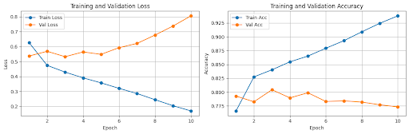
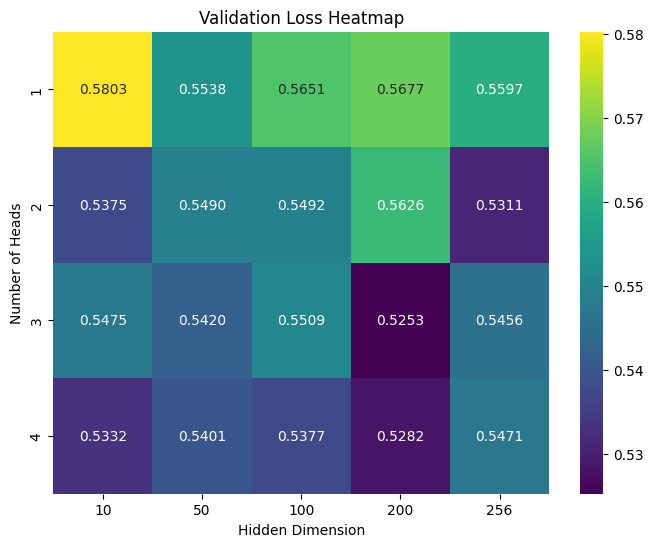
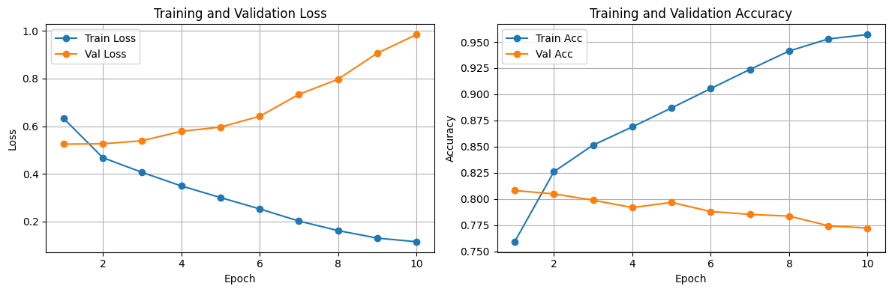
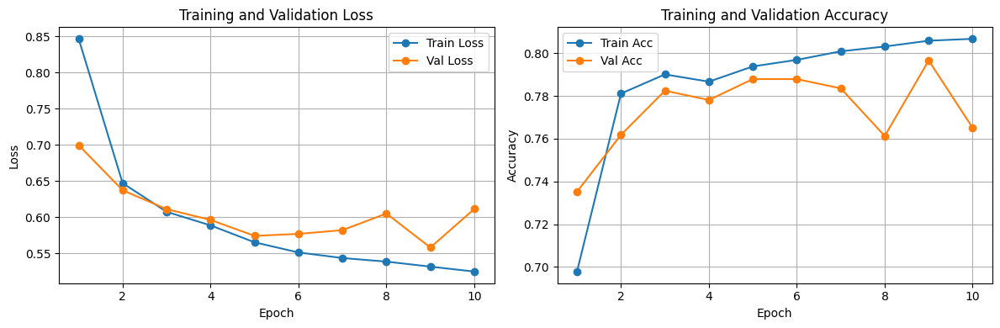
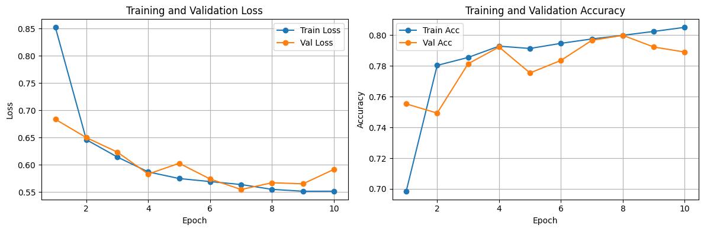
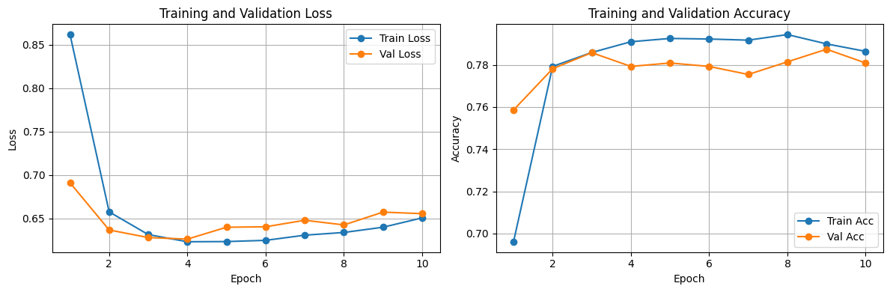
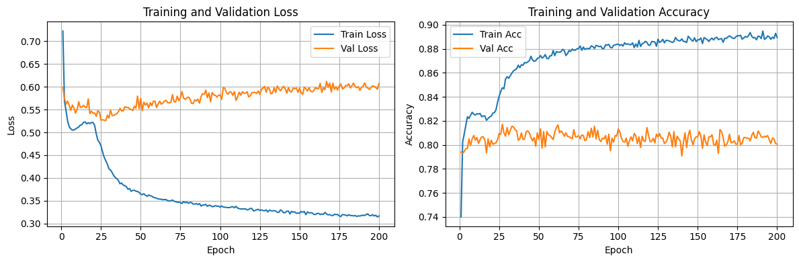

## Video Link
https://www.youtube.com/watch?v=aNuqik7dnr4

## Purpose

This project is intended to assess the extent to which the BERT Encoder model found on HuggingFace encodes the part of speech (e.g. verb, noun, adjective) as a part of the initial embeddings of words and to the extent that we can predict the part of speech based only on the embedding of a single word itself.

## Usage

1. Use the command "make" to run the Makefile and install dependencies
2. Go to preprocessing.ipynb and run each of the cells in order
3. To see the model in action, run the cells in model.ipynb in order (you may want to skip the cell with the grid search)
4. To TEST, run "pytest -m pytest test_model.py" in the terminal

## Preprocessing
Before building the model, I first built my dataset pulling from both kaggle and nltk word datasets. I then shifted these all into one csv file which had the words in one column and their part of speeches in a second column. After this, I removed all of the words with any strange symbols such as numbers, dashes, slashes, or punctuation marks. Finally, I used the BERT encoder model from HuggingFace to convert all of these words into their respective embeddings, added meaningless embeddings to add onto the end of the shorter words (this way the model would take all input tensors of the same shape), and created attention masks so that the model would not accidentally attend to these meaningless padding vectors.

## The Initial Model
This model I built is a single-layer transformer using an MLP with one hidden layer with n layers and a  multi-headed self-attention (MHA) with m heads without causal masking allowing embeddings to attend both forwards and backwards. The experimentation I plan on doing includes finding the optimal number of dimensions in hidden layers, number of attention heads, the number of hidden layers, and using other techniques such as dropout to decrease overfitting. I am using the Adam optimizer for the optimizer function using L2 regularization during training and using cross entropy loss as a loss function as well.

---

## Baseline
After initial training, I found that the model performed ok initially but was overfitting big time while training over many epochs. This was trained with one hidden layer in MLP, 2 attention heads, and a hidden dimension of 256. This is all likely too much and also likely too many epochs.

---

## Finetuning Hyperparameters
From this grid search, I found an optimal setting for this model of 6 heads and 192 dimensions in the hidden layer earning a validation loss of .5274. Although this could possibly be improved, I think this is a good place to stop for a base metric and experiment with more adjustments to the model itself to decrease overfitting.

Although this is a slight improvement, we can still clearly see that the model is majorly overfitting.

After adding and fine tuning a regularization term for the Adam optimization function (weight_decay = 1e-1), I was able to significantly decrease the overfitting while keeping most of the accuracy in the validation evaluation.

I then added dropout layers after attention each set to 0.2 and MLP to further decrease the overfitting. At this point, the model has more or less converged.

I then tried adding two layers inside of the MLP (along with relu activation and dropout) but this did not really help as much as I had hoped.

---

## Final Evaluation for 10 Epochs

---

## Final Results Evaluation - 200 Epochs
Although I thought my model was converging well after 10 epochs, I decided to run my model for longer - this time 200 epochs. I found that the model actually exhibited another overfitting behaviour where after 25 epochs, it actually began to overfit again though not as much as before. To mitigate this, I increased dropout layers to .5 and then up to .8 as well as increasing the weight_decay parameter. However, I found that no matter what I did at this point with this model, I was not able to meaning fully increase the the validation accuracy past about .805. While I was ultimately not sure how to improve the model past this point, I did actually pass my initial goal of beating my acuracy benchmark of .8 for validation.

